  

  
  
  
  

---

### `PROFILE`

**I build enterprise mobile systems, and I try to keep them clean enough that the next person can work on them too.**

Hello World. I'm Priyanshu Bej, a Senior Mobile Developer at **IRISS Inc.** in Bengaluru. Most of my days go into taking a product from a rough idea all the way to something running on real devices in real industrial plants, which usually means mobile apps, IoT hardware talking to them, a bit of AI, and whatever cloud glue holds it together.

I like problems where the app has to keep working when the network does not.

---

### `WHAT I'M BUILDING`

<table>
<tr><td width="33%" valign="top">

**E Sentry Systems**
`NFC ASSET MANAGEMENT`

Tap a sensor with your phone, pair it, see how the machine is doing, raise a work order. All of it built so a technician on a plant floor can do it with gloves on.

`Flutter` `Kotlin` `NFC` `REST`

</td><td width="33%" valign="top">

**IRISS SiteWalk**
`INDUSTRIAL INSPECTION`

Inspection tooling for the field. Walk the route, capture what you find, generate the report. Works offline first, because plant basements rarely have signal.

`Flutter` `Offline sync` `Cloud`

</td><td width="33%" valign="top">

**AI workflows**
`AGENTIC SYSTEMS`

Putting assistants and retrieval backed workflows directly inside products people already use, instead of bolting on a chatbot and calling it AI.

`Python` `LLMs` `RAG` `Agentic AI`

</td></tr>
</table>

<a href="https://www.priyanshubej.com/"><b>See the full work library</b></a>

---

### `WHAT I WORK WITH`

<table>
<tr><td width="18%"><code>01</code></td><td width="30%"><b>Mobile</b></td><td>

</td></tr>
<tr><td><code>02</code></td><td><b>How I structure things</b></td><td>

`Clean Architecture` `SOLID` `OOP` `Bloc` `Provider` `CI/CD` `GitHub Actions`

</td></tr>
<tr><td><code>03</code></td><td><b>Cloud and backend</b></td><td>

</td></tr>
<tr><td><code>04</code></td><td><b>AI and everyday tools</b></td><td>

</td></tr>
</table>

---

### `STUDYING`

**Executive Post Graduate Program in Generative AI and Agentic AI**
Indian Institute of Technology, Kharagpur `JUN 2026 to present`

The best way to predict the future is to build it, so I'm deep in generative AI, agentic systems, LLMs and RAG right now, and pulling whatever works into the products I ship at work.

Before this: **Master of Computer Applications**, Gandhi Institute for Technology, Bhubaneswar `2021 to 2023`

---

### `HOW I THINK ABOUT THE WORK`

> **Clean architecture is not about looking clever.** Clean Architecture, SOLID and solid OOP just mean the code stays readable six months later, when someone else has to change it.

> **Shipping is a skill of its own.** Agile habits and CI/CD pipelines on GitHub Actions mean releases stop being scary, and a team that isn't scared to release moves much faster.

> **The app should make someone's day easier.** That's the whole point. If a flow saves a technician two minutes on every inspection, that's worth more than any clever abstraction.

---

  <b>Working on something and want a hand with the mobile side? I'd like to hear about it.</b> 
  <a href="mailto:codewithpriyanshubej@gmail.com">codewithpriyanshubej@gmail.com</a>
  &nbsp;&nbsp;
  <a href="https://www.priyanshubej.com/">priyanshubej.com</a>

